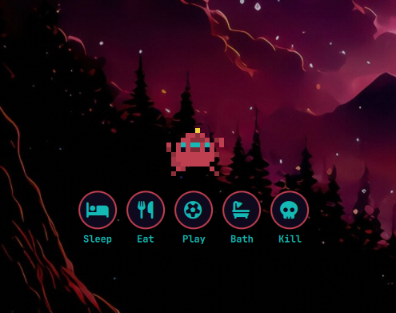

# tamOmarchy

A desktop pet for [Omarchy](https://omarchy.org/). An egg hatches on your screens; you name it (default **Mochi**), then it wanders, hops between monitors, and asks to be fed, played with, bathed, or put to sleep. Care for it from a bar sprite.

Plugin id: `io.github.nerddotdad.tamomarchy`



## Install

```bash
omarchy plugin add https://github.com/nerddotdad/tamomarchy.git --enable
```

That clones the plugin, validates the manifest, and enables it. The bar sprite lands on the **right** by default; move it with `omarchy bar move io.github.nerddotdad.tamomarchy`.

Omarchy will warn that plugins run unsandboxed inside `omarchy-shell`. Read this repository before you enable it.

## Remove

```bash
omarchy plugin remove io.github.nerddotdad.tamomarchy
```

That disables the plugin and deletes the checkout. It does not touch other bar widgets or plugins.

Pet progress is stored separately at:

```text
~/.local/state/omarchy/tamagotchi.json
```

Delete that file if you want a clean wipe (new egg, no graves).

## Requirements

Omarchy 4 (Quattro) or newer. No extra packages, no build step, no network access, and nothing outside this plugin directory plus the state file above.

Enabling and removing go through Omarchy’s plugin CLI, which writes only this plugin’s own entries in `~/.config/omarchy/shell.json`. The plugin does not rewrite the rest of your shell config.

## Using it

- The bar sprite opens the care panel (stats, playpen, maintenance, graves).
- Drag the pet. Hold to get Sleep, Eat, Play, Bath, and Kill. Drop on an action to start that mini-game.
- Tap the egg (without dragging far) to name and hatch it.
- Draw a playpen to keep it on one monitor; **Wander freely** clears the pen.
- It walks, and hops, across monitors. Mini-games stay on the screen where you started them.

Optional IPC, using the plugin id as the target:

```bash
omarchy-shell io.github.nerddotdad.tamomarchy toggle
omarchy-shell io.github.nerddotdad.tamomarchy state
```

## License

MIT, see [LICENSE](LICENSE). Font Awesome Free icons in `icons/` are CC BY 4.0; attribution is in that file.
